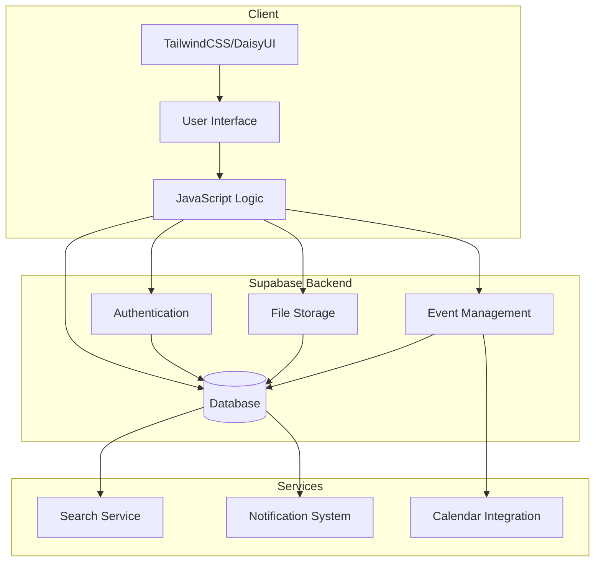

# FrontStreet

FrontStreet is a social media platform designed to elevate and connect Black artists, art collectors, and event venues in Boston, Massachusetts. Our mission is to create a vibrant digital space that celebrates diversity in art while providing practical tools for artists to showcase their work and grow their presence in the art community.

## 🎨 Features

### For Artists
- **Customizable Profiles**: Create a unique digital portfolio showcasing your artwork, artistic journey, and available pieces
- **Equal Exposure**: Benefit from our fair recommendation system that ensures balanced visibility
- **Direct Sales**: Connect directly with collectors and manage artwork sales seamlessly
- **Event Management**: Create and manage your own exhibitions, workshops, studio visits, and art events
- **Event Promotion**: Increase visibility for your upcoming shows and artistic activities

### For Collectors
- **Discovery Tools**: Explore a diverse range of artwork through our intelligent recommendation system
- **Purchase Management**: Easy-to-use tools for inquiring about and purchasing artwork
- **Collection Management**: Keep track of your art collection and interactions with artists
- **Event Discovery**: Find and bookmark upcoming exhibitions and art events

### For Venues
- **Event Management**: Create and manage art events, exhibitions, and workshops
- **Community Engagement**: Connect with local artists and collectors
- **Promotional Tools**: Increase visibility for upcoming events and exhibitions

## 🏗️ Technology Stack

- **Frontend**:
  - TailwindCSS for styling
  - DaisyUI for UI components
  - HTML5
  - Vanilla JavaScript for interactivity
- **Backend**:
  - Supabase for database and authentication
- **Deployment**:
  - Render for hosting and continuous deployment

## 🔄 System Architecture



## 🚀 Getting Started

1. **Prerequisites**
   - Node.js (v14 or higher)
   - npm or yarn
   - Supabase account

2. **Installation**
   ```bash
   # Clone the repository
   git clone https://github.com/georgebfreeman/frontstreet-lander.git

   # Install dependencies
   cd frontstreet-lander
   npm install
   npm run dev

   # Set up environment variables
   cp .env.example .env
   ```

3. **Configuration**
   - Set up your Supabase project and add credentials to `.env`
   - Configure TailwindCSS as needed

4. **Running locally**
   ```bash
   npm run dev
   ```

## 🤝 Contributing

We welcome contributions from the community! Please read our contributing guidelines before submitting pull requests.

## 📄 License

This project is licensed under the MIT License - see the LICENSE file for details.

## 🙏 Acknowledgments

- Boston's vibrant art community
- All contributing artists and collectors
- Open source community